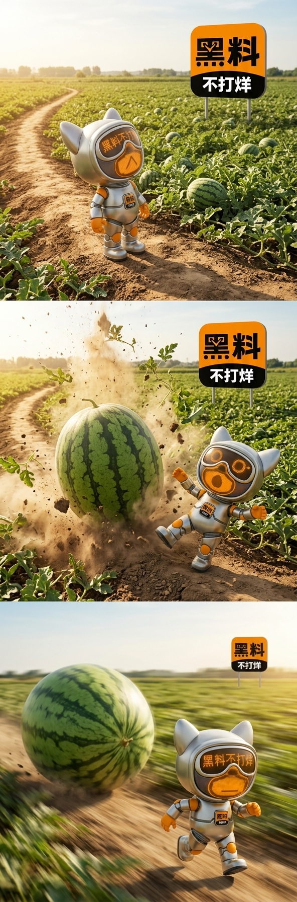

### 用Gemini跑三宫格动画关键帧
提示词示例：

第一张图为角色设定，第二张图为圆角矩形logo。生成具有镜头连续性性三宫格图片组成的长宽比为1：3的横幅长图，三宫格图尺寸都是1:1

第一宫格图内容为角色45°半侧身站立抬头看向天上，场景为田埂上，背景为一篇西瓜地，远处可见圆角矩形logo立在西瓜地里。摄像机为俯视角

第二宫格图为相同场景，相同背景，一个尺寸比角色还高的西瓜掉在角色面前并溅起尘土和西瓜叶，角色满脸夸张的惊讶表情和夸张的肢体动作。注意角色的眼镜和嘴巴都是LED灯珠排列显示出来的LED图案。摄像机为俯视角

第三宫格图为硕大的西瓜在画面的另一侧，西瓜追着角色滚动有滚动模糊效果，背景为运动模糊效果。角色在西瓜前面被西瓜追的气喘吁吁。远处的圆角矩形logo变的更远了更小了。摄像机为平视角

### 表情包内容结构：基础使用款——提高日常使用率

- 来了来了
    
- 有瓜？
    
- 细说
    
- 继续扒
    
- 我裂开了
    
- 顶不住了
    
- 笑死我了
    
- 无语住了
    
- 就这？
    
- 前排报道

相对正式一点，官方一点，系统默认性表情包，列出的是主题，也可用作为台词。
跑出来的关键帧用于 comfyui 图生视频，用关键帧把控视频的品质和方向，不至于出现 AI 幻觉|吗，
如果出现崩脸，请加这句：VR眼镜显示屏上显示由LED灯珠组成的···